<aside markdown="1">
<h4>Table of Contents</h4>
* ToC
{:toc}
</aside>

--------------------------------------------------------------------------------------------------------------------
## **Acknowledgements**

* This project is based on the AddressBook-Level3 project created by the [SE-EDU initiative](https://se-education.org).

--------------------------------------------------------------------------------------------------------------------
## **Introduction** ##

HR Manger is a simple to use and easy to learn local desktop application that allows you to easily manage your candidates, positions and interviews.
HR Manager is built on Java and can be run on all major desktop operating systems. HR Manager has a graphic user interface to display information and uses text-based commands to interact with the application.

--------------------------------------------------------------------------------------------------------------------
## **Purpose** ##

The purpose of this guide is to provide a comprehensive documentation of the design and overview of the application for developers to quickly onboard and develop the applciation.

You can read the entire guide from teh start, which will give you a complete view of the structure of HR Manager.

Alternatively, you can quickly get started by through the [Setting Up](setting-up-getting-started) and [Design](design) to get a overview of the application.
You can then read the [Feature Implementation](feature-implementation) for more details of specific features.

--------------------------------------------------------------------------------------------------------------------

## **Setting up, getting started**

*HR Manager* is a desktop application built with JavaFX GUI which aims to help with the HR management in small companies. With the application, the user will be able to easily manage their candidates, job postings, and interview sessions.

To set up the application, please refer to the guide [_Setting up and getting started_](SettingUp.md).

--------------------------------------------------------------------------------------------------------------------

## **Design**

:bulb: **Tip:** The `.puml` files used to create diagrams in this document can be found in the [diagrams](https://github.com/AY2122S1-CS2103T-W13-1/tp/tree/master/docs/diagrams/) folder. Refer to the [_PlantUML Tutorial_ at se-edu/guides](https://se-education.org/guides/tutorials/plantUml.html) to learn how to create and edit diagrams.

### Architecture

The ***Architecture Diagram*** given above explains the high-level design of the App.

Given below is a quick overview of main components and how they interact with each other.

**Main components of the architecture**

**`Main`** has two classes called [`Main`](https://github.com/AY2122S1-CS2103T-W13-1/tp/tree/master/src/main/java/seedu/address/Main.java) and [`MainApp`](https://github.com/AY2122S1-CS2103T-W13-1/tp/tree/master/src/main/java/seedu/address/MainApp.java). It is responsible for,
* At app launch: Initializes the components in the correct sequence, and connects them up with each other.
* At shut down: Shuts down the components and invokes cleanup methods where necessary.

[**`Commons`**](#common-classes) represents a collection of classes used by multiple other components.

The rest of the App consists of four components.

* [**`UI`**](#ui-component): The UI of the App.
* [**`Logic`**](#logic-component): The command executor.
* [**`Model`**](#model-component): Holds the data of the App in memory.
* [**`Storage`**](#storage-component): Reads data from, and writes data to, the hard disk.

**How the architecture components interact with each other**

The *Sequence Diagram* below shows how the components interact with each other for the scenario where the user issues the command `delete 1`.

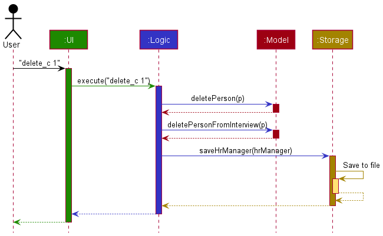

Each of the four main components (also shown in the diagram above),

* defines its *API* in an `interface` with the same name as the Component.
* implements its functionality using a concrete `{Component Name}Manager` class (which follows the corresponding API `interface` mentioned in the previous point.

For example, the `Logic` component defines its API in the `Logic.java` interface and implements its functionality using the `LogicManager.java` class which follows the `Logic` interface. Other components interact with a given component through its interface rather than the concrete class (reason: to prevent outside component's being coupled to the implementation of a component), as illustrated in the (partial) class diagram below.

The sections below give more details of each component.

### UI component

The **API** of this component is specified in [`Ui.java`](https://github.com/AY2122S1-CS2103T-W13-1/tp/tree/master/src/main/java/seedu/address/ui/Ui.java)

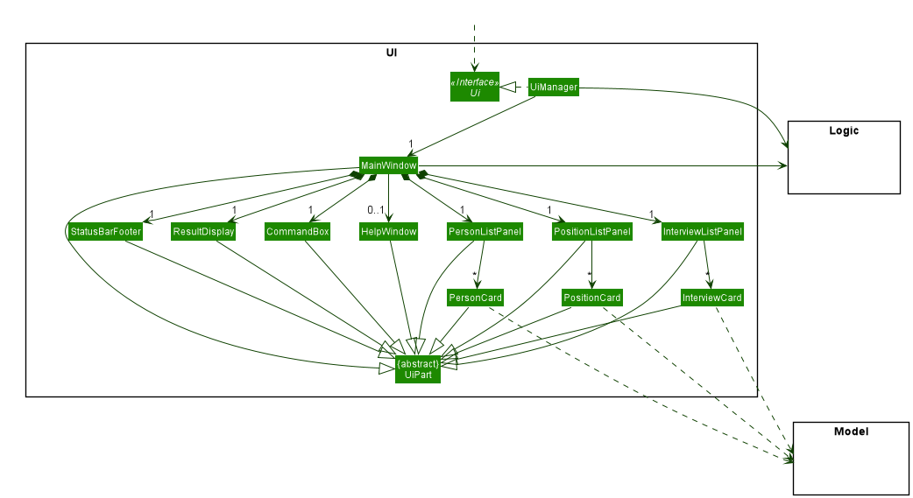

The UI consists of a `MainWindow` that is made up of parts e.g.`CommandBox`, `ResultDisplay`, `PersonListPanel`, `StatusBarFooter` etc. All these, including the `MainWindow`, inherit from the abstract `UiPart` class which captures the commonalities between classes that represent parts of the visible GUI.

The `UI` component uses the JavaFx UI framework. The layout of these UI parts are defined in matching `.fxml` files that are in the `src/main/resources/view` folder. For example, the layout of the [`MainWindow`](https://github.com/AY2122S1-CS2103T-W13-1/tp/tree/master/src/main/java/seedu/address/ui/MainWindow.java) is specified in [`MainWindow.fxml`](https://github.com/AY2122S1-CS2103T-W13-1/tp/tree/master/src/main/resources/view/MainWindow.fxml)

The `UI` component,

* executes user commands using the `Logic` component.
* listens for changes to `Model` data so that the UI can be updated with the modified data.
* keeps a reference to the `Logic` component, because the `UI` relies on the `Logic` to execute commands.
* depends on some classes in the `Model` component, as it displays `Person` object residing in the `Model`.

### Logic component

**API** : [`Logic.java`](https://github.com/AY2122S1-CS2103T-W13-1/tp/tree/master/src/main/java/seedu/address/logic/Logic.java)

Here's a (partial) class diagram of the `Logic` component:

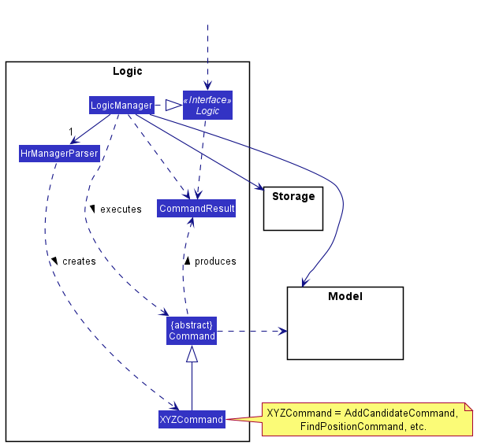

How the `Logic` component works:
1. When `Logic` is called upon to execute a command, it uses the `HrManagerParser` class to parse the user command.
1. This results in a `Command` object (more precisely, an object of one of its subclasses e.g., `AddCommand`) which is executed by the `LogicManager`.
1. The command can communicate with the `Model` when it is executed (e.g. to add a person).
1. The result of the command execution is encapsulated as a `CommandResult` object which is returned back from `Logic`.

The Sequence Diagram below illustrates the interactions within the `Logic` component for the `execute("delete 1")` API call.

:information_source: **Note:** The lifeline for `DeleteCommandParser` should end at the destroy marker (X) but due to a limitation of PlantUML, the lifeline reaches the end of diagram.

Here are the other classes in `Logic` (omitted from the class diagram above) that are used for parsing a user command:

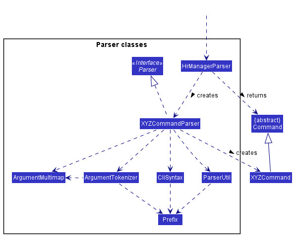

How the parsing works:
* When called upon to parse a user command, the `HrManagerParser` class creates an `XYZCommandParser` (`XYZ` is a placeholder for the specific command name e.g., `AddCandidateCommandParser`) which uses the other classes shown above to parse the user command and create a `XYZCommand` object (e.g., `AddCandidateCommand`) which the `HrManagerParser` returns back as a `Command` object.
    * Most significantly, the ArgumentTokeniser is used to parse the arguments using the provided prefixes to retrieve the inputs from the user
* All `XYZCommandParser` classes (e.g., `AddCandidateCommandParser`, `DeletePositionCommandParser`, ...) inherit from the `Parser` interface so that they can be treated similarly where possible e.g, during testing.

### Model component
**API** : [`Model.java`](https://github.com/AY2122S1-CS2103T-W13-1/tp/tree/master/src/main/java/seedu/address/model/Model.java)

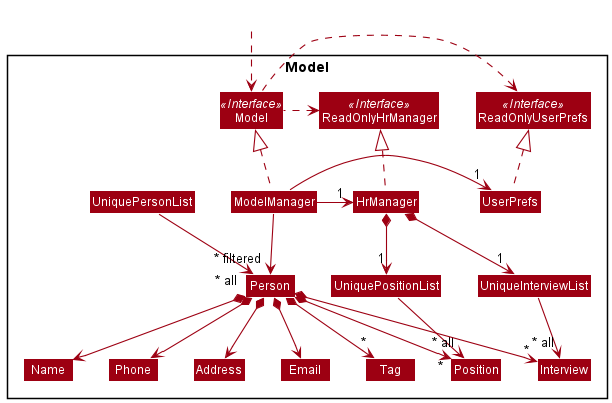

The `Model` component,

* stores the HR Manager data i.e., all `Person` objects (which are contained in a `UniquePersonList` object).
* stores the currently 'selected' `Person` objects (e.g., results of a search query) as a separate _filtered_ list which is exposed to outsiders as an unmodifiable `ObservableList<Person>` that can be 'observed' e.g. the UI can be bound to this list so that the UI automatically updates when the data in the list change.
* stores a `UserPref` object that represents the user’s preferences. This is exposed to the outside as a `ReadOnlyUserPref` objects.
* does not depend on any of the other three components (as the `Model` represents data entities of the domain, they should make sense on their own without depending on other components)

### Storage component

**API** : [`Storage.java`](https://github.com/AY2122S1-CS2103T-W13-1/tp/tree/master/src/main/java/seedu/address/storage/Storage.java)

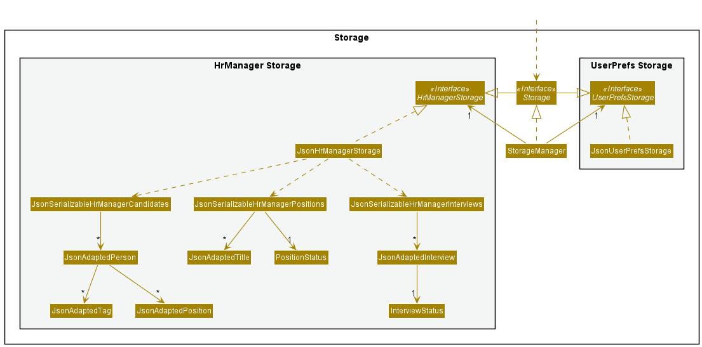

The `Storage` component,
* can save both HR Manager data and user preference data in json format, and read them back into corresponding objects.
* inherits from both `HrManagerStorage` and `UserPrefStorage`, which means it can be treated as either one (if only the functionality of only one is needed).
* depends on some classes in the `Model` component (because the `Storage` component's job is to save/retrieve objects that belong to the `Model`)

### Common classes

Classes used by multiple components are in the `seedu.address.commons` package.

--------------------------------------------------------------------------------------------------------------------

## **Documentation, logging, testing, configuration, dev-ops**

* [Documentation guide](Documentation.md)
* [Testing guide](Testing.md)
* [Logging guide](Logging.md)
* [Configuration guide](Configuration.md)
* [DevOps guide](DevOps.md)

--------------------------------------------------------------------------------------------------------------------
## **Feature Implementation** ##

### **Find Commands** ###

The `find_c`, `find_p` and `find_i` command allows users to search for candidates, positions and interviews using their parameters.
Generally, they are called `find_x` in this section

The class structure of an execution of `find_x` command is as follows. Only important classes are shown
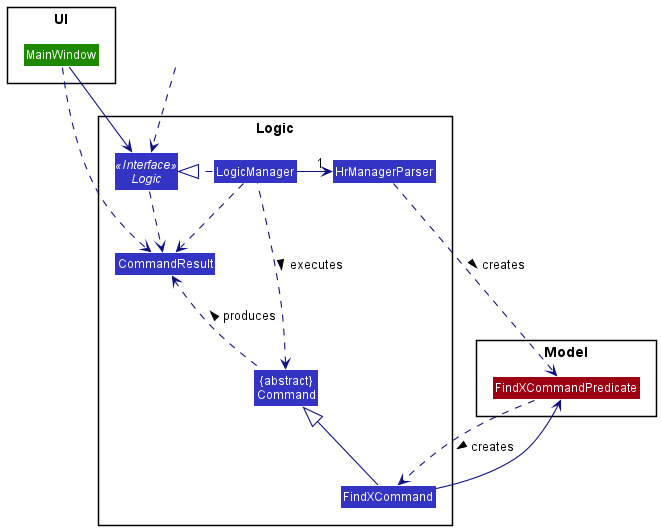

The `FindXCommandPredicate` holds the parsed arguments from the command and a `test` method to check if X fufils the condition

The sequence diagram of a `find_x` command execution is as follows

Firstly, the parsing of the command and argument occurs as follows
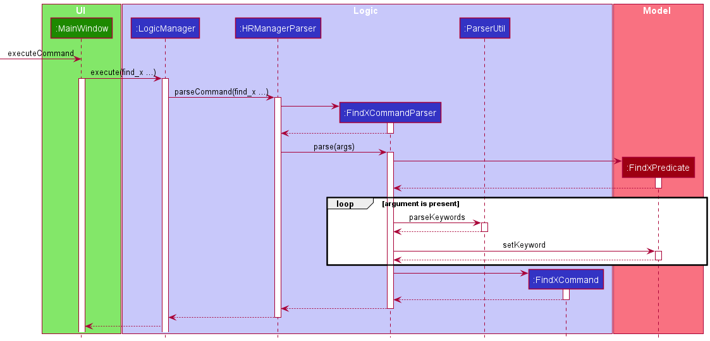

Continuing the previous diagram, the FindXCommand is executed, and the UI is updated
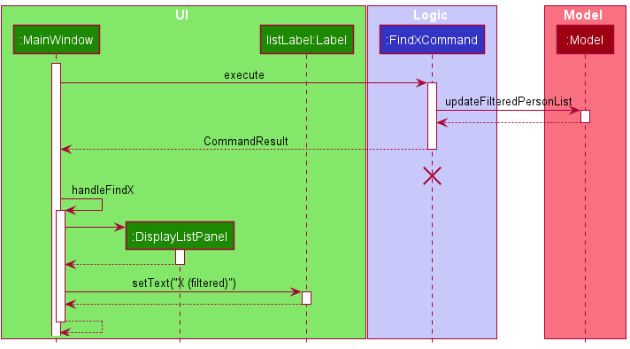

#### Design Considerations ####
Aspect: Logical operators and combinations for find fields
* Alternative 1: AND between separate fields and OR within multiple entries in same field
    * eg: `find_c name=alex brad phone=12345678` === `(phone=12345678) AND (name contains alex OR brad)`
    * Pros: Easy to implement, simple command format for the most common usecase
    * Cons: Unable to search using more complex combination of logical operators
* Alternative 2: Allow users to specify which operators are used and how they are combined
    * Pros: Give granular control to the user for find
    * Cons: Very complex command format

### **List Commands** ###

The `list_c`, `list_p` and `list_i` command allows users to list all candidates, positions and interviews in the respective display panel.
Generally, they are called `list_x` in this section

The class structure of an execution of `list_x` command is as follows. Only important classes are shown

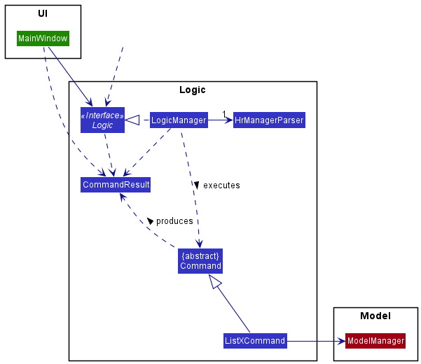

The `ListXCommandPredicate` uses the preset predicate such that all X fulfills the condition.

The sequence diagram of a `list_x` command execution is as follows

Firstly, the parsing of the command and argument occurs as follows

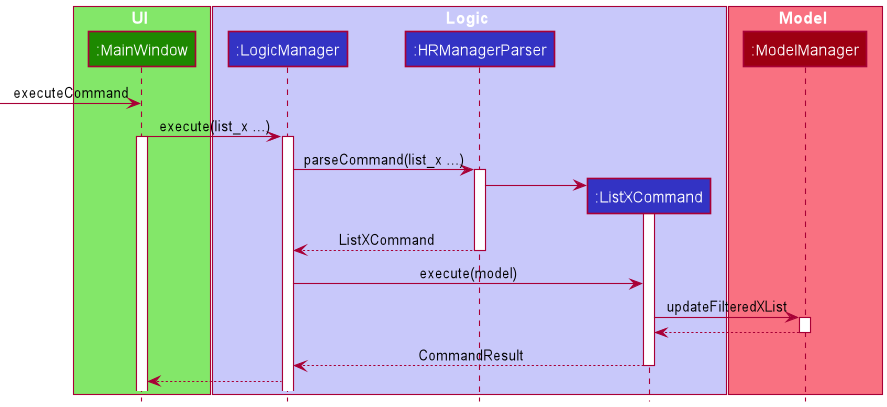

Continuing the previous diagram, the ListXCommand is executed, and the corresponding X panel in the UI is updated

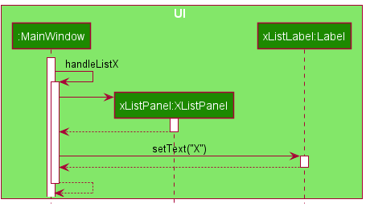

### **Edit Commands** ###

The `edit_c`, `edit_p` and `edit_i` commands allow users to edit a specific candidate, position
or interview in the respective display panel.

Generally, they are called `edit_x` in this section.

The edit mechanism is facilitated by `editXDescriptor`, where X is the object to be edited, for example
`editPersonDescriptor` for editing candidates, `editPositionDescriptor` for editing positions, and
`editinterviewDescriptor` for editing interviews, and each non-empty field value will replace the corresponding
field value of the object that is being edited. `editXDescriptor` stores the details to edit the candidate,
position or interview with. `editXCommand` extends `Command` and implements the
`Command#execute()` operation, which executes the command and returns a result message to be displayed.

Similar to any other command, the `Command#execute()` operation is exposed in the `Logic` interface as
`Logic#execute()`. Please refer to the 'Logic component' under 'Design' for information on how the `Logic`
component works when a command is executed.

As an example, the parsing and execution of an edit_p command is as follows

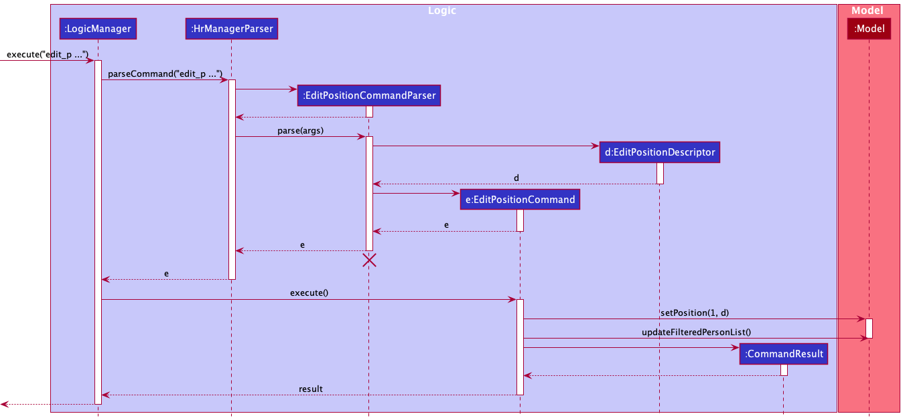

### **Add commands** ###

The `add_c`, `add_p` and `add_i` commands allow users to add a candidate, position
or interview in the respective display panel.

Generally, they are called `add_x` in this section. I will also be using X to represent a candidate, position or interview here.

The add_x functionality is facilitated by  `ModelManager`. It uses the following operation of `ModelManager`.
- `ModelManager#hasX` — Check if the candidate, position or interview already exists within Hr Manager. If so, `CommandException` will be thrown.

- `ModelManager#addX()` — Adds a candidate, position or interview to Hr Manager. If that position already exists, a
  `DuplicatePositionException` will be thrown.

`AddXCommandParser` and `AddXCommand` are created to achieve this functionality.
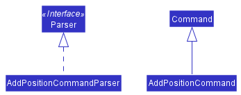

Given below is an example usage scenario and the workflow of the`add_x` command.

Step 1. The user executes command `add_x...`.
`Ui` component reads the command as a string from user's input. After that, `MainWindow`
passes the string to `LogicManager` to manipulate the command.

Step 2. `LogicManager` passes the command to `HrManagerParser` to parse the command. Since the command starts
with `add_x`, a new `AddXCommandParser` is created to parse the command further.

Step 3. `AddXCommandParser` uses `ArgumentMultimap` to tokenize the prefixes part the command. After extracting the
information of the object such as the title of a position or the name of a candidate, a new `X` is created and a new
`AddXCommand` is created with that `X`.

Step 4. `AddXCommand` passes the given `X` to `ModelManager#hasX`. If the position does not exist in the app, `AddXCommand`
passes the `Position` to `ModelManager#addPosition()`.

Step 5. `Modelmanager#addX()` updates the respective list with the new added `X`.

To better illustrate this example, the parsing and execution of an add_p command is as follows
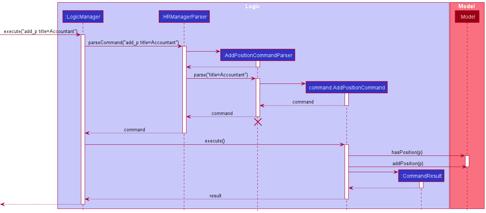

--------------------------------------------------------------------------------------------------------------------

## **Appendix: Requirements**

### Product scope

**Target user profile**:

* is HR professional
* has to manage multiple applicants, roles, and interviews
* prefer desktop apps over other types
* can type fast
* prefers typing to mouse interactions
* is reasonably comfortable using CLI apps

**Value proposition**: help them quickly enter the data into the system, reminders of interview timings and ranking of candidates for roles

### User stories

Priorities: High (must have) - `* * *`, Medium (nice to have) - `* *`, Low (unlikely to have) - `*`

| Priority | As a …​ | I want to …​                | So that I can…​                                                        |
| -------- | ---------- | ------------------------------ | ---------------------------------------------------------------------- |
| `* * *`  | user       | be able to add a candidate with all relevant information such as full name, age, contact information, scheduled interview time and date.|                  |
| `* * *`  | user       | be able to delete a candidate | remove the application if it was withdrawn entirely                                                                       |
| `* * *`  | user       | be able to see all active candidates | |
| `* * *`  | user       | be able to see the details of a specific candidate | |
| `* * *`  | user       | be able to edit the information related to a candidate | correct any wrongly filled information |
| `* * *`  | user       | be able to categorize the candidate, whether it was self-applied or referred | carry out administrative processes afterwards more easily |
| `* * *`  | user       | be able to add a remark/status to a candidate | make it more visible for the next course of administrative action|
| `* * *`  | user       | be able to edit comments of a candidate | update any further remarks for them|
| `* * *`  | user       | be able to delete comments of a candidate | remove mistakenly put remarks entirely |
| `* * *`  | user preparing interviews | be able to know the number of candidates on a certain day | |
| ` * * `  | user preparing interviews | be reminded what interviews I have the next day | not forget about them |
| ` * * `  | user preparing interviews | be able to reschedule the interview session for a candidate | |
| `* * *`  | user preparing interviews | be able to delete an interview session for a candidate if it no longer takes place | |
| ` * * `  | user preparing interviews | be able to schedule a new interview for a candidate | recruit more members |
| ` * * `  | user preparing interviews | be able to delete all other scheduled interview sessions for a particular candidate once I decide to assign him a particular post | |
| `* * *`  | user preparing interviews | be able to view all candidates who will be interviewed on a particular date | keep track of the interviews planned for that day |
| ` * * `  | user preparing interviews | be able to delete the interview sessions on a particular date | |
| `  *  `  | user preparing interviews | add a co-interviewer to an interview | I know who I will be interviewing the candidate with |
| ` * * `  | user after interviews | be able to mark a candidate as ‘Interviewed’ | |
| `* * *`  | user after interviews | be able to tag a candidate e.g. by the position they are applying for | group them according to the tags |
| `* * *`  | user       | want to be able to edit existing tags of a candidate | |
| `* * *`  | user       | be able to remove existing tags of a candidate | |
| ` * * `  | user searching for candidates | be able to filter the candidates for some specific requirements | find the right person for the post more efficiently |
| `* * *`  | user searching for candidates | be able to search for candidates who have a certain remark/description | find candidates by criteria |
| ` * * `  | user searching for candidates |  be able to search who applied for certain positions |  I know all the candidates for that specific position |
| ` * * `  | user preparing interviews | search what interviews I have for a particular date | better prepare for that day |
| ` * * `  | user       | see all the candidates scheduled for interview sessions for a particular job posting | |
| `* * *`  | user       | be able to search for a particular candidate to see his/her upcoming sessions | |
| `  *  `  | user       | be able to password lock the application to prevent unauthorised access | |
| `  *  `  | user       | encrypt the save file | prevent my data from being easily stolen |
| `* * *`  | user       | be able to add a job position with its job title |                  |
| `* * *`  | user       | be able to delete a job position | remove the job posting if it was no longer open |
| `* * *`  | user       | be able to see all posted job positions | |

### Use cases

(For all use cases below, the **System** is the `HR Manager` and the **Actor** is the `user`, unless specified otherwise)

#### <u>Use case: UC01 - Add a candidate</u>

**MSS**

1. User requests to add a new candidate, with the initial details of the new candidate.
2. User can see the added candidate.

   Use case ends.

**Extensions**

* 1a. The format when adding a candidate is incorrect.

    * 1a1. HR Manager shows an error message.

      Use case ends.

* 1b. The position title the user provided does not exist in the position list.

    * 1b1. HR Manager shows an error message.

      Use case ends.

#### Use case: UC02 - List all candidates</u>

**MSS**

1. User requests to list all candidates
2. HR Manager shows a list of all candidates

   Use case ends.

**Extensions**

* 2a. The list of candidates is empty.
    * 2a1. HR Manager shows that list is empty.

      Use case ends.

#### <u>Use case: UC03 - Delete a candidate</u>

**MSS**

1. User requests to <u>list all candidates (UC02)</u>.
2. User requests to delete a specific candidate.
3. HR Manager deletes the corresponding candidate and displays result.

   Use case ends

**Extensions**

* 3a. The given index is invalid.

    * 3a1. HR Manager shows an error message.

      Use case resumes at step 2.

#### <u>Use case: UC04 - Add a position</u>

**MSS**

1. User requests to add a new position, with the title of the new job position.
2. User can see the added job position.

   Use case ends.

**Extensions**

* 1a. The format when adding a position is incorrect.

    * 1a1. HR Manager shows an error message.

      Use case ends.

* 1b. The position title the user provided already exists in the position list.

  * 1b1. HR Manager shows an error message.

      Use case ends.

#### <u>Use case: UC05 - List all positions</u>

**MSS**

1. User requests to list all positions
2. HR Manager shows a list of all positions

   Use case ends.

**Extensions**

* 2a. The list of positions is empty.
    * 2a1. HR Manager shows that list is empty.

      Use case ends.

#### <u>Use case: UC06 - Delete a position</u>

**MSS**

1. User requests to <u>list all positions (UC05)</u>.
2. User requests to delete a specific position.
3. HR Manager deletes the corresponding position and displays result.

   Use case ends

**Extensions**

* 2a. The given index is invalid.

    * 2a1. HR Manager shows an error message.

      Use case resumes at step 2.

#### <u>Use case: UC07 - Add an interview</u>

**MSS**

1. User requests to <u>list all positions (UC05)</u>.
2. User requests to <u>list all candidates (UC03)</u>.
3. User requests to add an interview with details for the interview.
4. HR Manager adds interview.
5. User can see the added job position.

   Use case ends

**Extensions**

* 3a. The given position is invalid.

    * 3a1. HR Manager shows an error message.

      Use case resumes at step 3.

* 3b. The given index is invalid.

    * 3b1. HR Manager shows an error message.

      Use case resumes at step 3.

* 3c. The given date is invalid.

    * 3c1. HR Manager shows an error message.

      Use case resumes at step 3.

* 3d. The given time is invalid.

    * 3d1. HR Manager shows an error message.

      Use case resumes at step 3.

* 3e. The given duration is invalid.

    * 3d1. HR Manager shows an error message.

      Use case resumes at step 3.

* 3f. The given status is invalid.

    * 3d1. HR Manager shows an error message.

      Use case resumes at step 3.

#### <u>Use case: UC08 - List all interviews</u>

**MSS**

1. User requests to list all positions
2. HR Manager shows a list of all positions

   Use case ends.

#### <u>Use case: UC09 - Delete an interview</u>

1. User requests to <u>list all interviews (UC08)</u>.
2. User requests to delete a specific interview.
3. HR Manager deletes the corresponding position and displays result.

   Use case ends.

**Extensions**

* 2a. The given index is invalid.

    * 2a1. HR Manager shows an error message.

      Use case resumes at step 2.

### Non-Functional Requirements

1. Program needs to run on all operating systems with Java 11 installed.
2. Application needs to handle at least 500 candidates and 500 interviews without a noticeable sluggishness in performance for typical usage and no graphical errors.
3. A user with above average typing speed should be able to complete tasks faster using commands than they would have using a click-based interface.

### Glossary

* **Mainstream OS**: Windows, Linux, Unix, OS-X
* **Private contact detail**: A contact detail that is not meant to be shared with others
