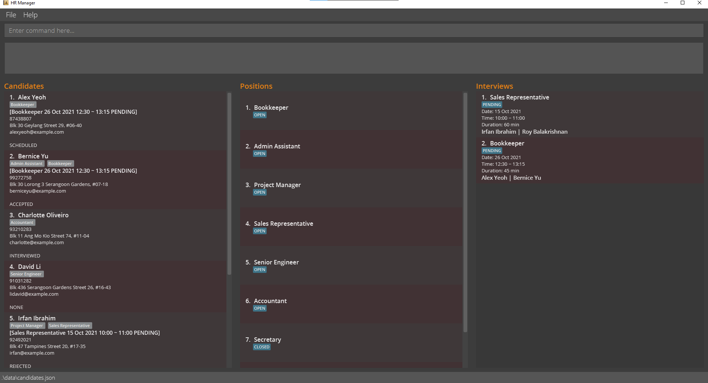

<aside markdown="1">
<h4>Table of Contents</h4>
* ToC
{:toc}
</aside>

## Introduction
HR Manger is a simple to use and easy to learn local desktop application that allows you to easily manage your candidates, positions and interviews.
HR Manager is built on Java and can be run on all major desktop operating systems. HR Manager has a graphic user interface to display information and uses text-based commands to interact with the application.

HR Manager will help you manage the candidates to be interviewed,
making the scheduling process easier and faster for your company!<br>
It is easy to interact with the app through simple to learn and easy to share text commands!<br>
Tired of losing track of scheduled interviews?<br>
HR manager's easy to use features will help you to arrange for upcoming interviews quickly in your desired manner.<br>
The data you provide will also be stored safely and securely for subsequent uses,
transferable to other devices too!

### Purpose
The purpose of this user guide is to give a complete documentation of HR Manger and allow you to easily get started on HR Manager.
The user guide is also the easiest way for you to troubleshoot any issues and clarify any questions you have with HR Manager.<br>
Lets simplify your HR processes!

### How to use this user guide?
This user guide is a complete guide for all commands and features for HR Manager.
You can read the whole guide for a comprehensive understanding of the application.
<br><br>
Alternatively, you can quickly get started using the [Quick Start](#quick-start) and [Command Summary](#command-summary).<br>
If you face any issues, you can check the details for each command under the [Features](#features) section.
There are 3 sections under the Features section: [Job Position Management](#feature-job-position-management), [Candidate Management](#feature-candidate-management) and [Interview Management](#feature-interview-management).
Each section has its own input table that details the requirements and restrictions of each input of that section.


--------------------------------------------------------------------------------------------------------------------

## Quick start

1. Ensure you have Java `11` or above installed in your Computer. You can check what version of Java you have by following this guide [here](https://www.java.com/en/download/help/version_manual.html).

2. Download the latest `HRManager.jar` from [here](https://github.com/AY2122S1-CS2103T-W13-1/tp/releases).

3. Copy the file to the folder you want to use as the _home folder_ for your HR Manager.

4. Double-click the file to start the app. The GUI similar to the below should appear in a few seconds. Note how the app contains some sample data.<br>
   

5. Type a command in the command box, which is the box that says "Enter command here...", and press Enter to execute it. e.g., typing **`help`** and pressing Enter will open the help window.<br>
   Some example commands you can try:

* **`list_c`** : Lists all candidates.

* **`add_c`**`name=Bryan Seah email=bsah@gmail.com phone=12345678 address=311, Clementi Ave 2, #02-25 position=Project Manager` : Adds a contact named `Bryan Seah` to the HR Manager.

* **`delete_c`**`3` : Deletes the 3rd candidate shown in the current candidate list.

* **`clear`** : Deletes all candidates, positions, interviews.

<div markdown="block" class="alert alert-info">

WARNING: Please note that `clear` is an irreversible command and all existing data will be permanently deleted.

</div>

* **`exit`** : Exits the app.

* Refer to [Features](#features) below for details of each command.

--------------------------------------------------------------------------------------------------------------------

## Features
<div markdown="block" class="alert alert-info">

**Notes about the command format:**<br>

* Words in `<UPPER_CASE>` are the parameters to be supplied by the user.<br>
  e.g., in `add_c name=<NAME>`, `NAME` is a parameter which can be used as `add_c name=John Doe`.

* Items in square brackets are optional.<br>
  e.g., `name=<NAME> [tag=<TAG>] [status=<STATUS>]` can be used as `name=John Doe tag=friend status=scheduled` or as `name=John Doe`.

* Items with `…`​ after them can be used multiple times including zero times.<br>
  e.g., `[position=<POSITION>]...​` can be used as ` ` (i.e. 0 times), `position=Accountant`, `position=Accountant position=Bookkeeper` etc.

* Parameters can be in any order.<br>
  e.g., if the command specifies `name=<NAME> phone=<PHONE_NUMBER>`, `phone=<PHONE_NUMBER> name=<NAME>` is also acceptable.

* If a parameter is expected only once in the command, but you specified it multiple times, only the last occurrence of the parameter will be taken.<br>
  e.g., if you specify `phone=12341234 phone=56785678`, only `phone=56785678` will be taken.

* Extraneous parameters for commands that do not take in parameters (such as `help`, `list`, `exit` and `clear`) will be ignored.<br>
  e.g., if the command specifies `help 123`, it will be interpreted as `help`.

</div>

### Feature: Job Position Management


Manage a list of job positions posted by your company, with the simple instructions below!


#### Table of Inputs for Position Management

| Parameter | Examples | Conditions |
| -------- | ------------------ | ------------------ |
| **TITLE** | `Software engineer`, `Accountant`| Must be alphanumeric (spaces allowed) and contain at least 1 character |
| **INDEX** | `1`, `2`| Must be a positive integer smaller than 2147483647 corresponding to the index of the intended position in the <U>currently displayed list of candidates<U/>|
| **STATUS** | `open`, `closed` | Must only be either of the 2 examples for the status of an interview, case insensitive |

All commands below are subjected to these restrictions except `find_p`

> Refer to the [Notes about the command format](#Features) for the details on the command format

#### <u>Add a position:</u> `add_p`

*Adds a job position to the list of positions.*

<u>Format:</u>

`add_p title=<TITLE>`

<u>Example:</u>

`add_p title=Assistant`

* Adds a job position with the title of Assistant, with a default status of 'open'.

* Adding a job position always sets the position status to 'open'. Refer to `edit_p` on how you can change the status
  of a job position to 'closed'.
  <br>
  <br>

#### <u>List all positions:</u> `list_p`

*Displays a list of all the positions stored in the application.*

<u>Format:</u>

`list_p`

  <br>

#### <u>Delete a position:</u> `delete_p`

*Deletes a position from the list of positions.*

<u>Format:</u>

`delete_p <INDEX>`

<u>Example:</u>

`delete_p 3`

* Deletes the 3rd position from the list of positions.
* Also deletes this position from every candidate who applied for the position
  <br>
  <br>

#### <u>Edit a position:</u> `edit_p`

*Edits a specific position's details. Only one edit field is needed, but users cannot edit both fields.
  For instance, you can either choose to edit the title of a position, or the status of the position,
  but not both at the same time.*

<u>Format:</u>

`edit_p <INDEX> [title=<TITLE>]`

OR<br>

`edit_p <INDEX> [status=<STATUS>]`

<u>Example:</u>

`edit_p 2 title=Data Analyst`

* Edits the title of the 2nd position in the list to 'Data Analyst'.

* Editing the title  of the specified position will update the position title in any scheduled interviews for
  that position, along with any candidates who have applied for that position.
  <br>
  <br>

`edit_p 3 status=closed`

* Edits the status of the 3rd position in the list to closed.
* Setting position status to close will delete the position from every candidate who applied for the position.
  <br>
  <br>

#### <u>Find a position:</u> `find_p`

*Filters the position list based on the parameters provided. Minimum of 1 field is needed. Searching is case-insensitive*

All fields are not subjected to the restriction in the input table and can take any string.

<u>Format:</u>

`find_p [title=<TITLE>]... [status=<STATUS>]...`

<u>Example:</u>

`find_p status=closed title=Accountant Engineer`

* Finds all positions that are closed and title contains "Accountant" or "Engineer"
  * (status contains word "closed") AND (title contains word "Accountant" OR "Engineer")
* Within 1 field, keywords are separated by a space
  * Command will find jobs that contains at least 1 of the keywords (OR)
* Across different fields
  * Command will return jobs that contain all the fields (AND)

  <br>
  <br>

### Feature: Candidate Management

Manage a list of candidates for your company, with the simple instructions below!
Each candidate is uniquely identified their email.
Different candidates can have the same name as along as they do not share the same email.
#### Table of Inputs for Candidate Management

| Parameter | Examples | Conditions |
| -------- | ------------------ | ------------------ |
| **NAME** | `Alex`, `Clarice`| Any string. Any leading or trailing spaces will be removed |
| **EMAIL** | `alex@gmail.com`, `clarice@usc`| In the format local-part@domain <br> 1. The local-part should only contain alphanumeric characters and these special characters, excluding the parentheses, (+_.-). The local-part may not start or end with any special characters. <br><br>2. This is followed by a '@' and then a domain name. The domain name is made up of domain labels separated by periods. <br> The domain name must: <br> - end with a domain label at least 2 characters long <br> - have each domain label start and end with alphanumeric characters <br> - have each domain label consist of alphanumeric characters, separated only by hyphens|
| **PHONE_NUMBER** | `928389492, 623792` | At least 3 numbers |
| **ADDRESS** | `Block 123, Woodlands Avenue 1, #09-34` | Any string. Any leading or trailing spaces will be removed |
| **POSITION** | `Software engineer`, `teSTer` | Title of any position that is currently open, case insensitive |
| **STATUS** | `None`, `Applied`, `Scheduled`, `Interviewed`, `Accepted`, `Rejected`, `Withdrawn` | Must be one of the given examples, case insensitive |
| **TAG** | `experienced`, `priority` | Must be alphanumeric, without spaces |
| **INDEX** | `1`,`2` | Must be a positive integer smaller than 2147483647 corresponding to the index of the intended candidate in the <U>currently displayed list of candidate<U> |
| **REMARK** | `Great Experience`, `@@@ ___ Test Remark` | Any string, leading or trailing spaces are removed|

> Status for candidates are different than statuses for position and interviews

All commands in this section are subjected to the restriction in this table except `find_c`

> Refer to the [Notes about the command format](#features) for the details on the command format

#### <u>Add a candidate:</u> `add_c`

*Adds a candidate to the list of candidates.*

<u>Format:</u>

`add_c name=<NAME> email=<EMAIL> phone=<PHONE_NUMBER> address=<ADDRESS> position=<POSITION>... [status=<STATUS>] [tag=<TAG>]...`

<u>Example:</u>

`add_c name=Bryan Seah email=bsah@gmail.com phone=12345678 address=311, Clementi Ave 2, #02-25 position=Project Manager status=Scheduled`

* Subjected to all constraints per the Table of Inputs for Candidate Management
* `STATUS` will default to `Applied` if field is left empty
    <br>
    <br>

#### <u>List all candidates:</u> `list_c`

*Displays a list of all the candidates stored in the application.*

<u>Format:</u>

`list_c`

  <br>

#### <u>Delete a candidate:</u> `delete_c`

*Deletes a candidate along with his/her details from the list of candidates.*

<u>Format:</u>

`delete_c <INDEX>`

<u>Example:</u>

`delete_c 3`

* Deletes the 3rd candidate along with his/her details from the list of candidates.
  * Also deletes this candidate from any interview he/she was scheduled for.
    <br>
    <br>


#### <u>Remark a candidate:</u> `remark_c`

*Adds a remark to a candidate.*

<u>Format:</u>

`remark_c <INDEX> remark=<REMARK>`

<u>Example:</u>

`remark_c 1 remark=20 years of experience`

* Adds a remark to the 1st candidate that he/she has 20 years of experience.
* There is practically no limit to the length of remark you can add
  <br>
  <br>

#### <u>Edit a candidate:</u> `edit_c`

*Edits a candidate's details. All the details of the candidate can potentially be edited. At least 1 edit field is needed. Fields specified will be <U>replaced</U> with the new value*

<u>Format:</u>

`edit_c <INDEX> [name=<NAME>] [email=<EMAIL>] [phone=<PHONE_NUMBER>] [address=<ADDRESS>] [status=<STATUS>] [tag=<TAG>]... [position=<POSITION>]...`

<u>Example:</u>

`edit_c 3 name=Ryan Koh`

* Edit the name of the 3rd candidate in the list to Ryan Koh.
* If a candidate has an [interview](#feature-interview-management), editing a status that is not `Applied` back to `Applied` is not allowed, and will be automatically changed to `Scheduled`. You can choose to change to other status such as `None`.


#### <u>Find a Candidate:</u> `find_c`

*Filters the candidate list based on the parameters provided. Minimum of 1 field is needed. Searching is case-insensitive*

All fields are not subjected to the restriction in the input table and can take any string

<u>Format:</u>

`find_c [name=<NAME>]... [email=<EMAIL>]... [phone=<PHONE_NUMBER>]... [address=<ADDRESS>]... [status=<STATUS>]... [tag=<TAG>]... [position=<POSITION>]...`

<u>Example:</u>

`find_c name=Alex tag=recommended priority`

* Finds all candidates that have the word "Alex" in their name and have position that contain the word "Accountant" or "Engineer"
  * (name contains "Alex") AND (title contains Accountant OR Engineer)
* Candidates that will be found
  * name="Alex Maslow", tags="recommended", ...
  * name="alex", tags="priority candidate",...
* Candidates that will not be found
  * name="AlexMaslow", tags="recommended", ... (Word "Alex" not in name)
  * name="Alex Maslow", tags="" (No tags containing word "recommended" or "priority")
* Within 1 field, keywords are separated by a space
  * Command will find candidates that contains at least 1 of the keywords (OR)
* Across different fields
  * Command will return candidates that contain all the fields (AND)


  <br>
  <br>


### Feature: Interview Management

Manage a list of scheduled interviews, with the simple instructions below!

#### Table of Inputs for Interview Management

| Parameter | Examples | Conditions |
| -------- | ------------------ | ------------------ |
| **POSITION** | `Software engineer`, `Accountant`| Must be added to HR Manager and must have been applied by corresponding candidates before it can be used |
| **INDEX** | `1`, `2`| Must be a positive integer smaller than 2147483647 corresponding to the index of the intended candidate in the <U>currently displayed list of candidates<U/>|
| **DATE** | `18/10/2021` for 18th October 2021, `1/9/2021` for 1st September 2021 | Must be in DD/MM/YYYY form and can tolerate single digit for day and month, but year must be 4 digits |
| **TIME** | `0600` for 6 a.m., `1800` for 6 p.m. | Must be in HHMM, following 24-hour format |
| **DURATION** | `120` for 120 minutes, `75` for 75 minutes | Must a positive integer more than 0 and less than 1440, number of minutes in a day|
| **STATUS** | `pending`, `completed` | Must only be either of the 2 examples for the status of an interview, case insensitive |

All commands in this section are subjected to the restriction in this table except `find_i`.

> Refer to the [Notes about the command format](#features) for the details on the command format

#### <u>Add an interview:</u> `add_i`
Use the following command to record the details of an interview session with the candidate(s) for a position!

*Adds an interview to the list of interviews.*

<u>Format:</u>

`add_i position=<POSITION> date=<DATE> time=<TIME> duration=<DURATION> [c=<INDEX>]... [interviewed=STATUS]`

<u>Example:</u>

`add_i position=Accountant c=1 2 date=18/10/2021 time=1400 duration=120 interviewed=pending`


* Adds an interview for the position of Accountant, for the 1st and 2nd candidates in the candidate list.
  The interview is scheduled to be on 18 October 2020, at 2p.m. and has a duration of 120 minutes. The interview's
  status is also provided as "pending", meaning that the interview has yet to be completed.

  Click [here](#table-of-inputs-for-interview-management) to see the conditions and examples for possible inputs.
  <br>
  <br>

#### <u>List all interviews:</u> `list_i`

*Displays a list of all the interviews stored in the application.*

<u>Format:</u>

`list_i`

  <br>

#### <u>Delete an interview:</u> `delete_i`

*Deletes an interview from the list of interviews.*

<u>Format:</u>

`delete_i <INDEX>`

<u>Example:</u>

`delete_i 3`

* Deletes the 3rd position from the list of interviews.
* Also deletes this interview from every candidate who were scheduled this interview
  <br>
  <br>


#### <u>Edit an interview:</u> `edit_i`

Edits a specific interview in the list of interviews.

<u>Format:</u>

`edit_i <INDEX> [position=<POSITION>]... [date=<DATE>]... [time=<TIME>]... [duration=<DURATION>]... [interviewed=<STATUS>]...`

<u>Example:</u>
`edit_i 2 date=18/10/2021 time=1400`
* Edits the second interview in the interview list and updates the date and time of the interview.

* All input fields should be provided in the correct format. Please refer to notes on interview command format shown
  above to see what constitutes a valid input.

* At least one input field must be edited. For instance, in the above example, two input fields have been edited -
  `date=18/10/2021` for the date of the interview and `time=1400` for the time the interview is scheduled for.

<div markdown="block" class="alert alert-info">

**NOTE:**
`edit_i` cannot be used to edit the candidates assigned to the specified interview.
  Please refer to `assign` and `unassign` commands below to see how you can add and remove candidates
  from a scheduled interview.

</div>
  <br>
  <br>

#### <u>Assign candidates to interview:</u> `assign`

*Assigns candidates to a specified interview.*

<u>Format:</u>

`assign i=<INTERVIEW_INDEX> c=<CANDIDATE_INDEX>...`

<u>Example:</u>
`assign i=1 c=2 4`

* You can input any number of candidates but only 1 interview.
* Adds candidates with candidate index 2 and 4 to the first interview.

<div markdown="block" class="alert alert-info">

**WARNING:**
* If the candidate has not applied to the position, attempting to assign the candidate to an interview
  for that position will result in an error message displayed.
</div>
  <br>
  <br>

#### <u>Unassign candidates from interview:</u> `unassign`

*Unassigns candidates from a specified interview.*

<u>Format:</u>

`unassign i=<INTERVIEW_INDEX> c=<CANDIDATE_INDEX>...`

<u>Example:</u>

`unassign i=1 c=2 4`

* You can input any number of candidates but only 1 interview.
* Removes candidates with candidate index 2 and 4 from the first interview.
* Inputting `c=*` removes all candidates from an interview.
  <br>
  <br>

#### <u>Find an Interview:</u> `find_i`

*Filters the candidate list based on the parameters provided. Minimum of 1 field is needed. Searching is case-insensitive*

All fields are not subjected to the restriction in the input table and can take any string.

<u>Format:</u>

`find_i [position=<POSITION>]... [c=<CANDIDATE_NAME>]... [date=<DATE>]... [time=<TIME>]...
    [duration=<DURATION>]... [interviewed=<STATUS>]...`

<u>Example:</u>

    find_i date=21/09/2021 time=1600

* Finds all interviews that are on 21/09/2021 and occur on 1600

<div markdown="block" class="alert alert-info">

**NOTE:**

* Interviews that will be found
  * date="21/09/2021", time="1500-1700"
  * date="21/09/2021", time="1600-1650"
* Interviews that will not be found
  * date="21/09/2020", time="1500-1700", ... (Not on 21/09/2021)
  * date="21/09/2021", time="1200-1300" (Interview not occurring on 1600)
* Within 1 field, keywords are separated by a space (except time)
  * Command will find candidates that contains at least 1 of the keywords (OR)
* Across different fields
  * Command will return candidates that contain all the fields (AND)
</div>
  <br>
  <br>

### Feature: Storage

Save information of all candidates, positions and interviews into a data file locally, on your device itself.

Modification of any information will be recorded immediately.

They will be saved in `data` folder in separate files: `/data/candidates.json`, `/data/positions.json`, and `/data/interviews.json`.

Note that `data` will be in the same folder as HR Manager.

If any entry from any of the data files is invalid, HR Manager will launch without any data entries.

<div markdown="span" class="alert alert-warning">

>:exclamation: **Caution:** <br>
The remaining segment for storage is for advanced users, regarding how the storage component is implemented.

</div>

The candidate, position and interview information will be saved using the JSON format below.

For a candidate,
```json
 [{
  "name" : "Charlotte Oliveiro",
  "phone" : "93210283",
  "email" : "charlotte@example.com",
  "address" : "Blk 11 Ang Mo Kio Street 74, #11-04",
  "remark" : "",
  "tagged" : [ "rejected" ],
  "positions" : [{
    "title" : "Assistant",
    "positionStatus" : "OPEN"
  }]
}]
```

For a position,

```json
[{
  "title" : "HR Manager",
  "positionStatus" : "OPEN"
}]
```

For an interview,

```json
[{
  "position" : "HR Manager",
  "candidateIDs" : [ "-550871537", "-2024498055" ],
  "date" : "18/10/2021",
  "startTime" : "1400",
  "duration" : "120",
  "status" : "PENDING"
}]
```
*Note that an interview does not save a candidate but its unique ID generated within the application.*

Certain fields are editable directly without repercussions <U>as long as the format is valid (as shown above)</U>, like **date**, **startTime**, **duration** and **status** in `Interviews.json`
However, the same cannot be said for fields of different files sharing the same information, like **positions** in `Candidates.json` and the entire `Positions.json` file.
Any discrepancy could cause HR Manager to display misrepresented information.

<div markdown="span" class="alert alert-warning">

>:exclamation:**Caution:** <br>
In general, modifying stored data directly is strongly discouraged.

If your changes to the data file made its format invalid, HR Manager will discard all stored data and start with an empty data file at the next run.
</div>


## FAQs
**Q**: When will my data be saved? <br>
**A**: Your data will be automatically saved after any command.

**Q**: How can I export my data? <br>
**A**: You can copy the save files, `/data/candidates.json`, `/data/positions.json`, and `/data/interviews.json`
and transfer it to another system's 'data' folder. <br>
Or better yet, copy the entire `/data` folder and overwrite the data folder of the system you wish to transfer to.
The transferred save files can then be loaded readily when using this application.

## Command summary

| Action | Format, Examples | Expected result |
| -------- | ------------------ | ------------------ |
| **Add position** | `add_p title=<TITLE>` <br><br> e.g., `add_p title=Software engineer` | New position added: <br> [Software engineer] |
| **List all positions** | `list_p` | Listed all positions |
| **Delete position** | `delete_p <INDEX>` <br><br> e.g., `delete_p 3` | Deleted Position: [Bookkeeper] |
| **Edit a position** | `edit_p <INDEX> title=<TITLE>` or `edit_p <INDEX> status=<STATUS>` <br><br> e.g., `edit_p 3 status=closed` | Edited Position: [Bookkeeper] |
| **Find a position** | `find_p [title=<TITLE>]... [status=<STATUS>]...` <br><br> e.g., `find_p title=Accountant Engineer status=closed` | Candidates found
| **Add a candidate** | `add_c name=<NAME> email=<EMAIL> phone=<PHONE_NUMBER> address=<ADDRESS> position=<POSITION>...[status=<STATUS>] [tag=<TAG>]...`  <br><br> e.g., `add_c name=Bryan Seah email=bsah@gmail.com phone=12345678 address=311, Clementi Ave 2, #02-25 position=Project Manager status=Scheduled` | New candidate added: Bryan Seah; Phone: 12345678; Email: bsah@gmail.com; Address: 311, Clementi Ave 2, #02-25; Status: SCHEDULED; Positions: [Project Manager] |
| **List all candidates** | `list_c` | Listed all candidates |
| **Delete a candidate** | `delete_c <INDEX>`<br><br> e.g., `delete_c 3` | Deleted Candidate: Bryan Seah; Phone: 12345678; Email: bsah@gmail.com; Address: 311, Clementi Ave 2, #02-25; Status: SCHEDULED; Positions: [Project Manager] |
| **Add remark to a candidate** | `remark_c <INDEX> remark=<REMARK>`<br><br>eg.`remark_c 1 remark=20 years of experience` | Added remark to Person: Bryan Seah; Phone: 12345678; Email: bsah@gmail.com; Address: 311, Clementi Ave 2, #02-25; Status: SCHEDULED; Remark: 20 years of experience; Positions: [Project Manager] |
| **Edit a candidate** | `edit_c <INDEX> [name=<NAME>] [email=<EMAIL>] [phone=<PHONE_NUMBER>] [address=<ADDRESS>] [status=<STATUS>] [tag=<TAG>]... [position=<POSITION>]...` <br> e.g., `edit_c 3 phone=98602125 email=bryanseah@gmail.com` | Edited Candidate: Bryan Seah; Phone: 98602125; Email: bryanseah@gmail.com; Address: 311, Clementi Ave 2, #02-25; Status: SCHEDULED; Positions: [Project Manager] |
| **Find candidates** | `find_c [name=<NAME>]... [email=<EMAIL>]... [phone=<PHONE_NUMBER>]... [address=<ADDRESS>]... [status=<STATUS>]... [tag=<TAG>]... [position=<POSITION>]...` <br> e.g., `find_c name=Alex tag=recommended priority` | Candidates Found
| **Add an interview** | `add_i position=<POSITION> [c=<INDEX>]... date=DATE time=TIME duration=DURATION [interviewed=STATUS]` <br><br> e.g., `add_i position=Accountant c=1 2 date=18/10/2021 time=1400 duration=120 interviewed=pending` | New interview added: [Accountant [Bernice Yu, David Li] 18 Oct 2021 14:00 - 16:00 PENDING] |
| **List all interviews** | `list_i` | Listed all interviews |
| **Delete an interview** | `delete_i <INDEX>`<br><br> e.g., `delete_i 1` | Deleted Interview: [Accountant [Bernice Yu, David Li] 18 Oct 2021 14:00 - 16:00 PENDING] |
| **Edit an interview** | `edit_i <INDEX> [position=POSITION]... [date=DATE]... [time=TIME]... [duration=DURATION]... [interviewed=STATUS]...` <br><br>e.g., `edit_i 2 date=21/10/2021 time=1400` | Edited Interview: [Data Analyst [Jenny Lim, Max Tan] 21 Oct 2021 14:00 - 16:00 PENDING] |
| **Assign candidates** | `assign i=<INTERVIEW_INDEX> c=<CANDIDATE_INDEX>...` <br><br>e.g., `assign i=1 c=4`| Candidates added to interview: [Project Manager 20 Oct 2021 15:00 - 16:00 PENDING]: <br> 1. David Li |
| **Unassign candidates** | `unassign i=<INTERVIEW_INDEX> c=<CANDIDATE_INDEX>...` <br><br>e.g., `unassign i=1 c=4`| Candidates removed from interview: [Project Manager 20 Oct 2021 15:00 - 16:00 PENDING]: <br> 1. David Li |
| **Find interview** | `find_i [position=POSITION]... [c=<CANDIDATE_NAME>]... [date=DATE]... [time=TIME]... [duration=DURATION]... [interviewed=STATUS]...` <br><br> e.g., `find_i date=21/09/2021 time=1600` | Interviews found
